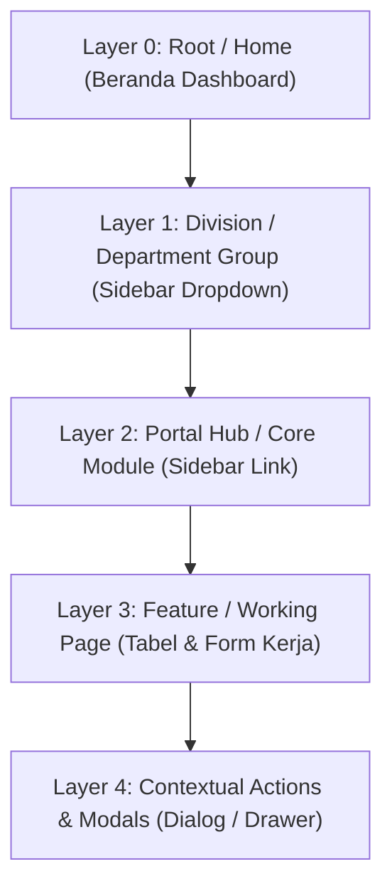

# Standar Arsitektur Navigasi & Layering Menu MIS

Dokumen ini mendefinisikan standar **Information Architecture (IA)**, hierarki layer navigasi, konvensi routing, penamaan divisi Layer 1 (Corporate English + Industry Acronym), dan pola antarmuka pengguna (UI/UX) pada aplikasi **MIS (Management Information System)**.

---

## 1. Hierarki Layer Navigasi

Sistem navigasi MIS distandarisasi ke dalam **5 tingkat hierarki (Layer 0 s.d. Layer 4)**:



### Rincian Definisi Layer

| Layer | Nama Layer | Elemen di Aplikasi | Karakteristik & Fungsi | Contoh Real di MIS |
| :--- | :--- | :--- | :--- | :--- |
| **Layer 0** | **Root / Home** | Main MIS Dashboard | Halaman beranda utama tempat ringkasan eksekutif, widget global, dan navigasi awal. | `Beranda` (`/dashboard`) |
| **Layer 1** | **Division / Department** | Dropdown Group di Sidebar | Pengelompokan divisi berstandar korporat modern (English + Akronim Industri). | **Operations**, **Human Capital**, **Finance, Accounting & Tax**, **Corporate Communication**, **Technology**, **RPHU Operations** |
| **Layer 2** | **Portal Hub / Modul** | **Link yang diklik di Sidebar** | Halaman hub katalog yang menampilkan kartu-kartu sub-modul dan metrik ringkas per domain. | **Tax** (`/tax`), **Quality Assurance** (`/qa`), **DOC**, **Pengguna** |
| **Layer 3** | **Feature / Working Page** | Kartu / Menu di dalam Portal Hub | Halaman kerja operasional utama (Data Table, Filter, Pagination, Export/Import). | **Laporan Masa** (`/tax/laporan-masa`), **SOP QA**, **STP** |
| **Layer 4** | **Sub-Action / Modals** | Dialog Modal / Drawer Form | Aksi kontekstual mendalam per baris data atau entri baru tanpa meninggalkan halaman. | **Modal Pembetulan**, **Modal Uraian**, **Form Add/Edit** |

> **Catatan Direct Bypass (Layer 2 ke 3):**  
> Jika suatu modul master/operasional tidak memiliki halaman portal katalog (misalnya *Master Pengguna* atau *DOC*), link di sidebar langsung mengarahkan user ke **Layer 3 (Working Page)**.

---

## 2. Standar Penamaan Divisi (Layer 1) & Pemetaan Modul

Semua nama divisi di **Layer 1** menggunakan standar bahasa Inggris korporat (*Corporate English*) dengan mempertahankan akronim industri perunggasan lokal (**RPHU**):

```text
├── Layer 0: Beranda (/dashboard)
│
├── Layer 1: Operations
│   ├── Layer 2: Production (Farm Recording, Brooding & Harvest)
│   ├── Layer 2: DOC Logistics (/operation/doc)
│   ├── Layer 2: Feed & Medvac Logistics (Pakan & OVK)
│   └── Layer 2: Sales & Marketing (Livebird Sales & Catching)
│
├── Layer 1: Human Capital
│   ├── Layer 2: Personalia
│   ├── Layer 2: Pelatihan & Pengembangan
│   └── Layer 2: Audit Internal
│
├── Layer 1: Finance, Accounting & Tax
│   ├── Layer 2: Accounting
│   ├── Layer 2: Finance
│   └── Layer 2: Tax (/tax) -> Portal Hub
│       ├── Layer 3: Laporan Masa (/tax/laporan-masa)
│       │   ├── Layer 4: Modal Tambah / Edit Laporan
│       │   ├── Layer 4: Modal Riwayat Pembetulan SPT
│       │   └── Layer 4: Modal Catatan Uraian
│       ├── Layer 3: Surat Tagihan Pajak (STP)
│       ├── Layer 3: Laporan PPh Unifikasi
│       ├── Layer 3: Rekap Pajak per AP
│       └── Layer 3: Rekap Gabungan Pajak
│
├── Layer 1: Corporate Communication
│   ├── Layer 2: Monitoring & Reporting
│   └── Layer 2: Quality Assurance (/qa) -> Portal Hub
│       ├── Layer 3: Standar Operasional Prosedur (SOP)
│       ├── Layer 3: Surat Edaran
│       └── Layer 3: Log Dokumen (Menu Logdoc)
│   └── Layer 2: SRM (Stakeholder Relationship Management)
│
├── Layer 1: Technology
│   ├── Layer 2: MIS Dashboard
│   ├── Layer 2: IT Infrastructure
│   └── Layer 2: System Audit
│
├── Layer 1: RPHU Operations (Poultry Processing)
│   ├── Layer 2: Penerimaan Ayam Hidup
│   ├── Layer 2: Proses Pemotongan & Karkas
│   └── Layer 2: Cold Storage & Distribusi
│
├── Layer 1: Master Data
│   └── Layer 3: Pengguna (/master/users) [Bypass Layer 2]
│
└── Layer 1: System Settings
    ├── Layer 3: Ubah Profil (/profile)
    └── Layer 3: Reset Kata Sandi (/settings/password)
```

---

## 3. Konvensi Breadcrumb & Routing

Setiap halaman di **Layer 3** wajib menyertakan komponen `<PageHeader />` dengan breadcrumb yang mencerminkan hierarki layer:

```jsx
<PageHeader
    title="Laporan Masa Pajak"
    breadcrumbs={[
        { label: 'Portal Tax', href: route('tax.portal') }, // Layer 2
        { label: 'Laporan Masa', href: null },              // Layer 3 (Active)
    ]}
/>
```

### Pola Penamaan Route URL:
- **Layer 2 (Portal):** `/{domain}` *(contoh: `/tax`, `/qa`)*
- **Layer 3 (Feature):** `/{domain}/{sub-fitur}` *(contoh: `/tax/laporan-masa`, `/qa/sop`)*
- **Layer 3 Direct:** `/{domain}/{master}` *(contoh: `/master/users`)*

---

## 4. Panduan Penambahan Modul Baru (Developer Guide)

1. **Tentukan Layering:**
   - Jika modul memiliki > 2 sub-fitur dengan domain terkait, buat **Portal Hub (Layer 2)** terlebih dahulu.
   - Jika modul tunggal berdiri sendiri (misal: Master Table), langsung arahkan sebagai **Direct Feature (Layer 3)**.
2. **Daftarkan ke Sidebar:**
   - Masukkan `SidebarLink` di dalam `SidebarDropdown` departemen yang relevan di `resources/js/Layouts/AuthenticatedLayout.jsx`.
3. **Standarisasi Tampilan Layer 3:**
   - Wajib menggunakan komponen bersama: `DataTable`, `Pagination`, `PageActions`, `Tabs`, dan filter standar AP/Tahun.
   - Aksi detail baris (seperti riwayat revisi atau catatan) ditangani via `DialogModal` di **Layer 4**.
